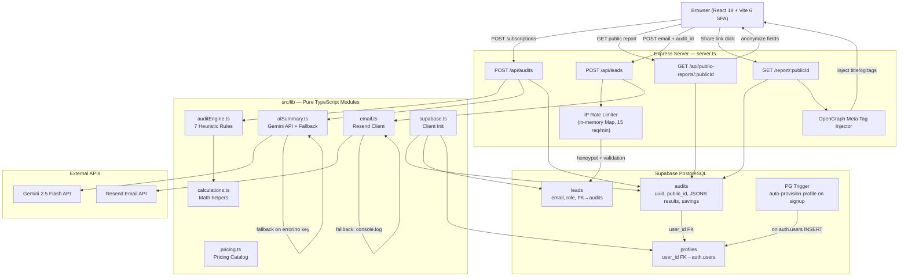

# Auto Audit — Architecture

## System Diagram



---

## Full Audit Flow Walkthrough

### Step 1: User Enters Subscription Data

The React `AuditForm` component renders a multi-step wizard. Each step lets the user:
- Search and select an AI tool from the catalog (`pricing.ts`)
- Choose the plan tier (e.g., Claude Team at $25/seat)
- Assign it to a department (Engineering, Product, Marketing, etc.)
- Enter seat count and mark it active or inactive

This data is accumulated in React state as an array of `SubscriptionItem` objects. No server call is made until the user submits.

### Step 2: POST /api/audits

The form POSTs the full payload to `/api/audits`:
```json
{
  "company_name": "Acme Corp",
  "domain_name": "acme.com",
  "team_size": 25,
  "use_case": "Coding",
  "subscriptions": [...],
  "user_id": "uuid-if-authenticated"
}
```

### Step 3: Deterministic Audit Engine (`auditEngine.ts`)

`runAuditAnalysis()` runs 7 sequential heuristic rules against the subscription array:

| Rule | Trigger Condition | Action |
|---|---|---|
| **A** | Cursor + Copilot in same dept | Flag Copilot as redundant, savings = overlapping seats × Copilot cost/seat |
| **B** | Cursor + Windsurf in same dept | Flag Windsurf, recommend consolidation |
| **C** | 2+ chat assistants (GPT/Claude/Gemini) in same dept | Flag cheaper one as redundant |
| **D** | Claude Team < 5 seats | Seat minimum waste — downgrade to Pro Individual |
| **D** | ChatGPT Team = 1 seat | Seat minimum waste — downgrade to Plus |
| **E** | Total active seats > team_size × 1.3 | Ghost seat detection, flag surplus |
| **F** | OpenAI API or Anthropic API active | Recommend semantic caching layer (20% savings estimate) |
| **G** | 3+ individual Pro seats expensed separately | Recommend consolidating to central team invoice (15% savings) |

The engine also catches any subscription marked `inactive` with `seats > 0` and recommends formal cancellation.

Savings are computed deterministically — no randomness, no LLM involvement. The `potentialMonthlySavings` is the sum of all recommendation savings. Annual savings = monthly × 12.

### Step 4: Gemini AI Summary

After the engine runs, `generateAISummary()` is called with the key metrics. It sends a prompt to Gemini 2.5 Flash requesting a ~100-word executive summary. The prompt is constrained: specific word count, specific focus areas, no introductory filler. If the API key is absent or the call fails, `getFallbackSummary()` returns a structured template using the same numbers.

### Step 5: Save to Supabase

The audit results (subscriptions as JSONB, recommendations as JSONB, savings as `NUMERIC(10,2)`) are written to the `audits` table with a randomly generated `public_id` (`audit-${crypto.randomBytes(6).toString('hex')}`). If the user is authenticated, `user_id` is linked.

### Step 6: Response + Shareable URL

The server returns the full report object and a `shareableUrl` derived from the request host and public ID. The frontend stores this in `localStorage` and navigates to the dashboard.

### Step 7: Public Report Access

When someone opens `/report/audit-abc123`, the server:
1. Fetches the audit from Supabase by `public_id`
2. Anonymizes: company name → `"Anonymous Startup"`, domain → `"anonymous.io"`, departments → `"Team A"`, `"Team B"`, etc.
3. Scrubs any company name occurrences from recommendation text with `String.replace(regex, anonymizedName)`
4. Returns the sanitized report

If a crawler (Slack, Twitter, LinkedIn) hits the same URL, the server detects it early in the `/report/:publicId` route handler, injects dynamic `<og:title>`, `<og:description>`, and `<og:image>` tags directly into the HTML before sending it. The SPA handles the rest client-side.

---

## Technology Choices

### React 19 + Vite 6

React is the obvious choice for a dashboard-heavy SPA with lots of interactive form state. Vite was chosen over CRA because it's significantly faster to start in dev mode, supports hot module replacement out of the box, and has a straightforward TypeScript setup. React 19 was fine for the scope here — nothing in this project requires 18-specific features.

### TypeScript

The audit engine does financial math and rule matching. Type safety isn't optional when you're computing savings estimates that users will act on. TypeScript catches the edge cases — `undefined` seat counts, wrong property names, missing fields — before they reach production. The `tsc --noEmit` check in CI ensures nothing ships with type errors.

### Express.js (Unified Server)

A dedicated Express server handles API routes and also serves the frontend via Vite middleware in dev and `express.static` in prod. This is a non-standard setup — most tutorials tell you to use Vite's built-in dev server directly. The reason for Express: the OpenGraph meta injection requires server-side HTML manipulation before the response is sent. Vite alone can't do that without a custom plugin. Express gives full control over the response pipeline.

### Supabase

Supabase was chosen primarily for three reasons:
1. **Hosted Postgres** — structured relational data (audits, leads, profiles) with JSONB for the flexible parts (subscriptions, recommendations)
2. **Row Level Security** — built-in policy engine means I don't need custom auth middleware for user-owned data
3. **Auth** — email/password auth with session tokens, email confirmation, and the `auth.users` table that the profiles FK references

The alternative was a simple SQLite file or a MongoDB Atlas free tier. SQLite would have worked fine locally but complicates horizontal scaling. MongoDB would have been overkill for this data model — it's relational enough that Postgres is clearly the right fit.

### Vitest

Test runner for the audit engine unit tests. Vitest is configured by Vite's ecosystem — zero separate config file needed, same TypeScript compilation pipeline. The tests import `runAuditAnalysis` directly and verify outputs. Fast, simple.

### Resend

Resend handles transactional email. The alternative was Nodemailer with an SMTP relay (SendGrid, Mailgun). Resend has a simpler API and a generous free tier. The email module degrades to a console log if the key is missing, which made local development frictionless.

---

## Audit Engine Design: Deterministic vs. Probabilistic

The core design decision was whether to let an LLM generate the recommendations or to hardcode the rules.

**The LLM approach** would look like: "Here is this company's subscription list. Tell me what to cut." This is tempting because it's flexible — it could catch patterns the rules don't cover. But it has two problems:
1. The output isn't reproducible. Running the same input twice might produce different recommendations.
2. It's impossible to unit test. You can't write `expect(report.potentialMonthlySavings).toBe(123)` if the LLM decides savings are $110 today and $135 tomorrow.

**The deterministic approach** treats each recommendation pattern as an explicit rule with a clear formula. The rules are based on real pricing mechanics (Claude's 5-seat minimum, ChatGPT's 2-seat minimum, the specific overlap between Cursor and Copilot). The savings calculations are exact, verifiable, and unit-testable.

The LLM plays a supporting role: it writes the executive *summary* of the deterministic output, not the output itself. This is the correct division of responsibility.

---

## Scaling to 10,000 Audits/Day

At 10k audits/day (~115 req/min peak), the current architecture needs these changes:

**Database:**
- The `audits` table has an index on `public_id`. At 10k writes/day, Postgres handles this fine without sharding. The JSONB columns will bloat — consider extracting `recommendations` to a separate normalized table if query patterns need filtering across recommendation types.
- Connection pooling via PgBouncer (Supabase provides this via the connection pool mode).

**Rate Limiter:**
- The in-memory `Map` doesn't work across multiple server instances. Replace with `express-rate-limit` + `ioredis` backed by an Upstash Redis instance (~$10/mo for the scale needed here).

**Gemini API:**
- At 10k audits/day, every audit hitting Gemini adds latency and cost. Consider making the AI summary async: return the deterministic report immediately, enqueue a background job (Vercel's Queue or a simple Supabase Edge Function) to generate and store the summary asynchronously, then the client polls or uses a WebSocket for the summary update.

**OpenGraph Injection:**
- The current injection reads from disk on every crawler request. Cache the rendered HTML per `publicId` in Redis with a 24-hour TTL.

**Frontend:**
- Nothing changes. The SPA is statically served from a CDN edge at deploy time. Vite's production build generates hashed asset filenames for cache busting.

---

## Security and Privacy

**Public Report Anonymization**

The `/api/public-reports/:publicId` endpoint runs every field through an anonymization pass before responding:
- `company_name` → `"Anonymous Startup"`
- `domain_name` → `"anonymous.io"`
- `department` names → sequential labels (`"Team A"`, `"Team B"`)
- Recommendation `description` and `reasoning` text → `String.replace` with a global regex replacing the company name

This prevents a shared link from leaking the submitting organization's identity to the public.

**Honeypot + Rate Limiting**

The leads form includes a hidden `honeypot` field. Bots that auto-fill all form fields will set this, and the server silently rejects the request. The IP-based rate limiter adds a second layer (15 req/min per IP). These two together block most unsophisticated spam without requiring a CAPTCHA.

**RLS Policies**

Supabase's Row Level Security prevents the `anon` role (used by unauthenticated clients) from deleting or updating any records. All write policies are `INSERT`-only for anonymous users. The `profiles` table is `SELECT/INSERT/UPDATE` only for the `authenticated` role matching `auth.uid() = id`.

**Environment Variables**

No secrets are hardcoded. All keys are loaded from `.env` via `dotenv/config`. The `.env` file is in `.gitignore`. The `.env.example` file documents the required keys without values.

**No PII in Logs**

The server logs `[API Audit Error]`, `[Resend Email Sent Successfully]`, etc., but never logs email addresses, company names, or subscription data. The Resend console log fallback in dev mode prints the full HTML email but only to the local terminal, not to any remote logging service.
