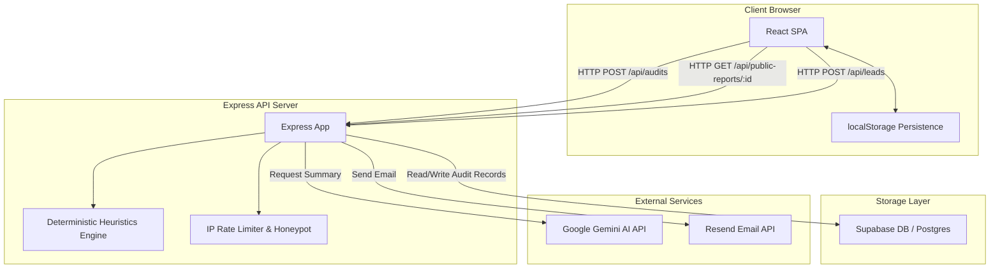
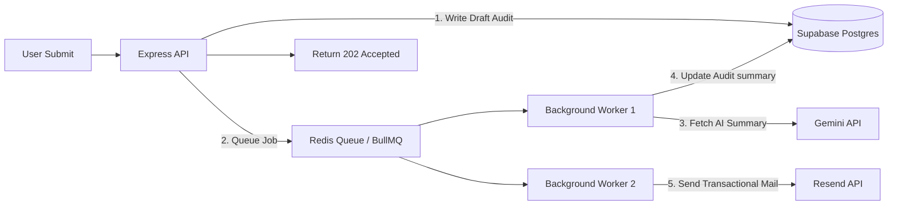

# Auto Audit — System Architecture

This document details the architectural layout, core data flows, stack justifications, and scalability design for the **Auto Audit** spend optimization platform.

---

## 1. System Overview

Auto Audit is built using a modern, decoupled client-server architecture with external serverless and API integrations.

---

## 2. Audit Data Flow

The lifecycles of an audit calculation follow a highly structured pipeline:

1. **Input Declaration**: The user specifies organization details (headcount, domain, primary use case) and declares active SaaS licenses via the wizard form.
2. **Diagnostic Scan (Deterministic Engine)**:
   - The backend runs calculations on the subscriptions.
   - It executes standard heuristics (e.g., standardizing code editors, chatbot consolidation, plan seat minimum limits, and ghost seats calculations).
   - An optimization scorecard is outputted containing the recommendations array, monthly/annual savings, and stack breakdowns.
3. **AI Executive Summary**:
   - The calculated scorecard metrics are sent to the Gemini API (`gemini-1.5-pro` or fallback).
   - Gemini compiles a concise ~100-word summary highlighting the primary waste area.
4. **Persistence Layer**:
   - The report is written to the Supabase `audits` table under a unique `public_id`.
   - The user receives the full scorecard report back in the response.
5. **Lead Capture & Transactional Email**:
   - The user inputs their email to receive the PDF scorecard.
   - The server writes the lead to the database and dispatches a structured HTML email via Resend including the shareable report URL.
6. **Social Previews**:
   - Shared report links (`/report/:publicId`) query the database and serve a pre-rendered HTML file containing OpenGraph and Twitter card meta tags for clean social media previews.

---

## 3. Tech Stack Justification

| Layer | Technology | Decision Rationale |
| :--- | :--- | :--- |
| **Frontend UI** | React + TailwindCSS | Allows building a high-fidelity, interactive form state and reactive dashboard charts with minimal overhead. |
| **Backend API** | Express + TypeScript | Lightweight, fast startup times, complete type safety across backend endpoints, and easy integration with Vite dev middleware. |
| **Database** | Supabase (Postgres) | Instant serverless database access, built-in connection resilience, clean TS clients, and zero maintenance overhead. |
| **AI Layer** | Gemini API | Industry-leading speed and reasoning performance, permitting rapid textual audits summaries within ~1-2 seconds. |
| **Email Gateway** | Resend | Modern developer-focused transactional email gateway with clean API structures and robust analytics. |

---

## 4. Scaling Architecture: Handling 10,000 Audits / Day

Scaling to **10,000 audits per day** (averaging ~7 audits/minute, with peak rates of 50-100 audits/minute during viral sharing events) introduces key bottleneck points:
- **Gemini API & Resend latency**: Network calls to external APIs can take 2+ seconds and are rate-limited.
- **Synchronous blockages**: Express threads blocking while awaiting AI/email responses can crash the process under heavy concurrent traffic.
- **Database connections**: Spikes in concurrent raw Postgres connections will exhaust the connection limits.

To scale the architecture to meet this load safely, the system will transition to an **asynchronous queue architecture**:

### Architectural Upgrades for 10k/Day:
1. **Asynchronous Job Queues (BullMQ / Redis)**:
   - The client-facing `POST /api/audits` route immediately writes the calculated scorecard (derived deterministically in milliseconds) to the database, schedules a background task, and returns a `202 Accepted` response with the public ID.
   - Background worker processes pick up audit summaries and email dispatches asynchronously, keeping user request cycles under 100ms.
   - The client UI uses polling or Supabase Realtime WebSockets to update the UI once the worker writes the AI summary back to the audit record.
2. **Database Pooling & Resilience**:
   - Integrate connection poolers (PgBouncer) to multiplex connection handles and prevent Supabase connection exhaustion.
   - Set up query read-replicas for serving public reports to prevent read-heavy report pages from slowing down new audit calculations.
3. **Caching Stratagem**:
   - Cache public reports in memory (using Redis) for 24-48 hours. Since public reports are static, hitting the database repeatedly is wasteful.
4. **Cloudflare CDN Integration**:
   - Protect API endpoints against brute force attacks with rate limits.
   - Cache the frontend static assets (JS, CSS, index.html) at the edge, reducing backend hosting server load.
